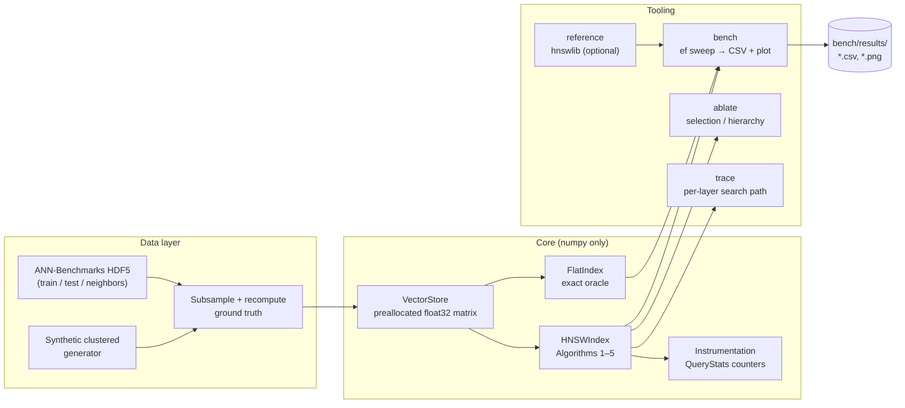
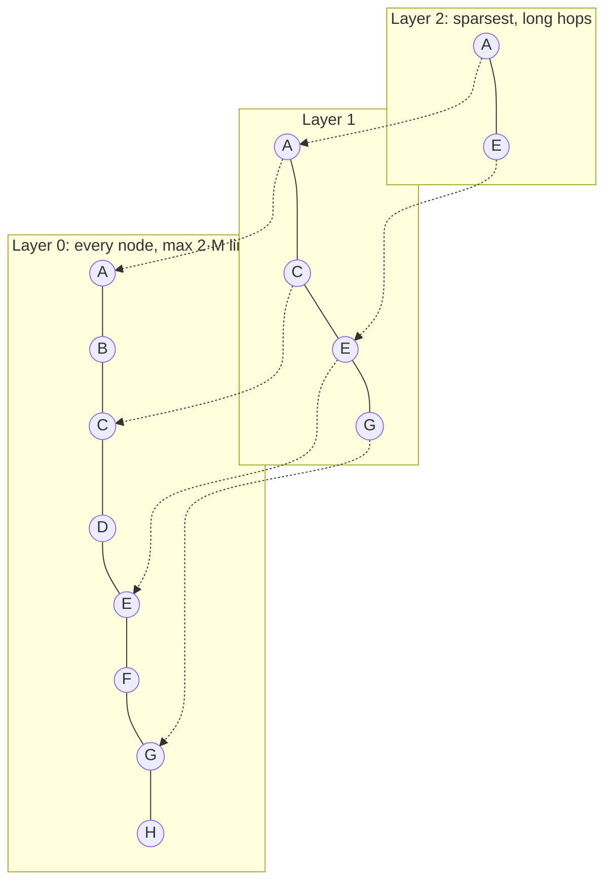
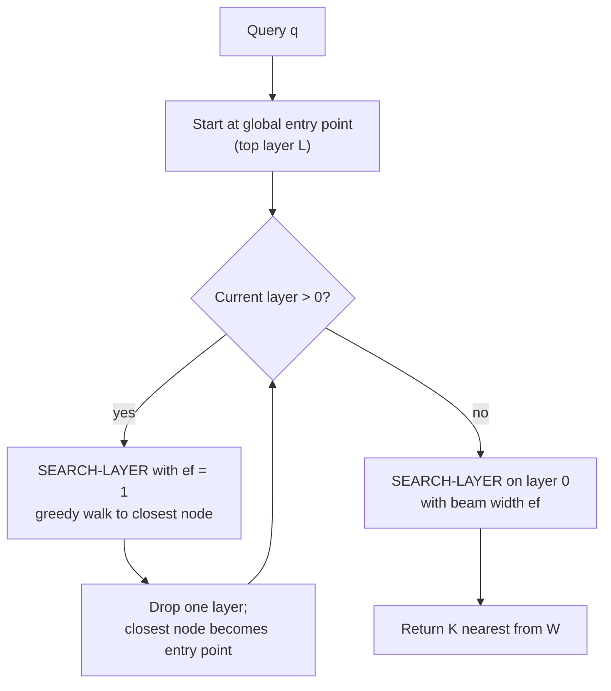
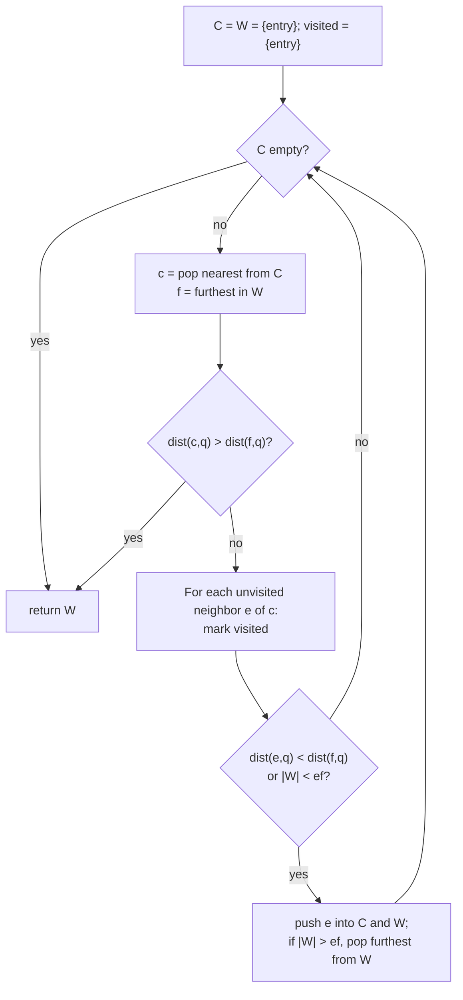
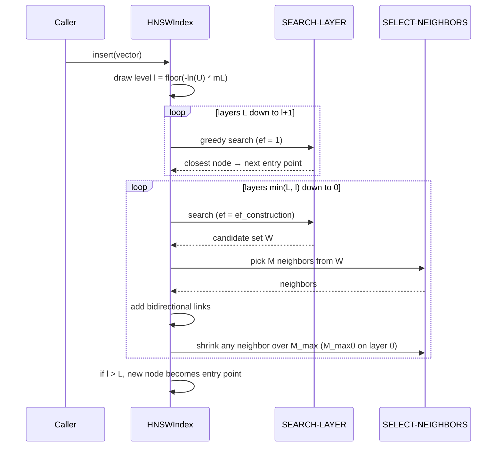
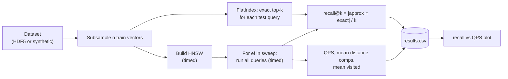

# Loam

**A readable, instrumented HNSW vector index in pure Python. It is built line-by-line from the paper, checked against brute force, and reports its recall honestly.**


Loam is a from-scratch implementation of **Hierarchical Navigable Small World (HNSW)** graphs, the approximate nearest-neighbor (ANN) algorithm behind most modern vector search (hnswlib, FAISS's `IndexHNSWFlat`, pgvector's HNSW index, Qdrant, Weaviate, Elasticsearch). Every core function maps one-to-one to an algorithm in Malkov & Yashunin's paper. Every search result can be checked against an exact brute-force oracle, and every query can report the work it did.

The name comes from soil. Loam is layered and porous, and water finds fast paths through it. HNSW works the same way: queries sink through sparse upper layers to reach a dense bottom layer quickly.

> **Rule for this repo:** every number in this README is pasted from the stdout of a command in this repo, run on a clean checkout. If a number has no command next to it, it does not belong here.

---

## Table of Contents

- [Why Loam](#why-loam)
- [What Makes Loam Different](#what-makes-loam-different)
- [Features](#features)
- [Architecture](#architecture)
- [How It Works](#how-it-works)
- [Tech Stack](#tech-stack)
- [Project Structure](#project-structure)
- [Getting Started](#getting-started)
- [Usage Examples](#usage-examples)
- [Benchmarks](#benchmarks)
- [Testing](#testing)
- [One-Day Build Plan](#one-day-build-plan)
- [Learning Objectives](#learning-objectives)
- [Non-Goals](#non-goals)
- [Roadmap](#roadmap)
- [Contributing](#contributing)
- [License](#license)
- [References](#references)

---

## Why Loam

Every RAG pipeline ends in a call like `collection.query(embedding, k=10)`. Behind that call sits an ANN index that makes a trade you never see. It returns *approximately* the nearest neighbors, and how approximate depends on parameters such as `M`, `ef_construction` and `ef`, which most users never touch.

This causes three practical problems:

1. **Recall degrades silently.** A too-small `ef` returns plausible but wrong neighbors. Nothing errors, and your retrieval quality just drops.
2. **The trade-off is invisible.** Production libraries expose knobs but not the work each query did (hops, visited nodes, distance computations), so you can't build intuition for why a setting helps.
3. **The algorithm is treated as magic.** HNSW is a graph built in a few hundred lines of logic. After building it once, tuning any vector database stops being guesswork.

Loam exists to make that machinery visible: small enough to read in one sitting, and measured precisely enough to trust.

---

## What Makes Loam Different

Loam is **not** faster than hnswlib or FAISS, and never will be. Those are optimized C++ with SIMD. Loam's value is in what it lets you *see and verify*:

| Capability | hnswlib / FAISS / pgvector | Loam |
|---|---|---|
| Production speed | ✅ | ❌ (pure Python + numpy) |
| Code maps 1:1 to the paper's Algorithms 1–5 | ❌ | ✅ |
| Per-query instrumentation (hops per layer, visited nodes, distance computations) | ❌ | ✅ |
| Built-in exact oracle for recall@k on every benchmark | ❌ (external) | ✅ |
| Search-path trace through each layer | ❌ | ✅ `loam trace` |
| One-flag ablation: heuristic vs simple neighbor selection | ❌ | ✅ |
| One-flag ablation: hierarchy on vs off (flat NSW) | ❌ | ✅ |

The two ablations reproduce **published claims** at laptop scale:

- **Neighbor-selection heuristic.** The HNSW paper (Fig. 7) reports that the diversity heuristic (Algorithm 4) matters most on *clustered* data, where simple nearest-M selection gets stuck at cluster boundaries. Loam ships a synthetic clustered-data generator to test this directly.
- **Is the "H" necessary?** *Down with the Hierarchy* (Munyampirwa et al., arXiv:2412.01940) reports that on high-dimensional data a flat navigable small-world graph matches HNSW's recall and latency, and attributes this to a "highway" of hub nodes. Loam's `--no-hierarchy` flag collapses every node to layer 0 so you can measure this yourself.

Loam reports what it measures, whichever way the result goes. If the results disagree with a paper, the README says so.

---

## Features

- **Exact flat index (`FlatIndex`).** A vectorized brute-force k-NN that serves as the correctness oracle for everything else.
- **HNSW index (`HNSWIndex`)** implementing the paper's algorithms under their own names:
  - `insert` → Algorithm 1 (INSERT)
  - `_search_layer` → Algorithm 2 (SEARCH-LAYER)
  - `_select_neighbors_simple` → Algorithm 3
  - `_select_neighbors_heuristic` → Algorithm 4 (with `extend_candidates` and `keep_pruned_connections` flags)
  - `knn_search` → Algorithm 5 (K-NN-SEARCH)
- **Paper-default parameters:** `M=16`, `M_max0 = 2·M`, `mL = 1/ln(M)`, `ef_construction=200`, all overridable.
- **Two metrics:** `cosine` (vectors are L2-normalized at insert, so distance = `1 − dot`) and `l2` (squared Euclidean).
- **Deterministic builds.** Pass a `seed` and the same data produces the same graph, bit for bit.
- **Per-query instrumentation.** Distance computations, nodes visited, and hops per layer, returned in a `QueryStats` object.
- **Benchmark harness (`loam bench`).** Sweeps `ef` and records recall@k against the flat oracle, single-threaded QPS, mean distance computations per query and build time. Writes a CSV and a recall-vs-QPS plot.
- **Ablation runner (`loam ablate`):** `--selection {simple,heuristic}` and `--no-hierarchy`.
- **Search tracer (`loam trace`).** Prints the path a single query takes through each layer.
- **Dataset loader** for ANN-Benchmarks HDF5 files. It can subsample the data, and it recomputes ground truth after subsampling, because the shipped ground truth covers the *full* train set. It also includes a synthetic clustered-data generator.
- **Optional reference comparison** against hnswlib, run on the same data with the same `M`, `ef_construction` and `ef`.

---

## Architecture



**Design decisions**

- **Vectors live in one preallocated `float32` matrix.** Node IDs are row indices. Distances from a query to a whole neighbor list are computed in a single numpy operation (`matrix[neighbor_ids] @ q`) instead of a Python loop. This is the single most important performance decision in a pure-Python HNSW.
- **Adjacency is `layers[level][node_id] -> list[int]`**, plain Python lists. They are readable, easy to inspect, and easy to assert invariants on.
- **Candidate set `C` is a min-heap; result set `W` is a max-heap** (distances negated), using `heapq`, exactly as Algorithm 2 describes.
- **Cosine is implemented by normalizing at insert time**, so the hot path is a dot product.
- **The oracle is non-negotiable.** No recall number is reported without an exact k-NN computed by `FlatIndex` on the same data.

---

## How It Works

### The layered graph

Each inserted element gets a random maximum layer `l = ⌊−ln(U(0,1)) · mL⌋`, where `U(0,1)` is uniform and `mL = 1/ln(M)`. Few elements reach the high layers, and every element exists on layer 0. Upper layers hold long-range links, and layer 0 holds short, dense ones.



### Search (Algorithm 5 → Algorithm 2)



Inside **SEARCH-LAYER** (Algorithm 2):



### Insert (Algorithm 1)



### Neighbor selection: simple vs heuristic

- **Simple (Algorithm 3)** keeps the `M` closest candidates.
- **Heuristic (Algorithm 4)** walks candidates nearest-first and keeps `e` only if `e` is closer to `q` than to every neighbor already kept. The result is spread across directions instead of bunched into one cluster, which is what keeps the graph navigable on clustered data.

### Benchmark workflow



---

## Tech Stack

| Layer | Tool | Why |
|---|---|---|
| Language | **Python 3.12+** | Fast to build in a day; readability is the product |
| Numerics | **numpy 2.x** | Vectorized distance computations; the only core dependency |
| Data | **h5py** | Reads ANN-Benchmarks HDF5 datasets |
| CLI | **typer** + **rich** | Typed commands and readable terminal tables |
| Plots | **matplotlib** | Recall-vs-QPS curves |
| Testing | **pytest** + **hypothesis** | Unit tests plus property-based graph-invariant tests |
| Packaging | **uv** (pip also works) | Reproducible environments |
| Reference (optional) | **hnswlib** | Sanity comparison on the same data and parameters |
| CI | **GitHub Actions** | Tests on every push |

> `hnswlib` 0.8.0 is published on PyPI as a source distribution only, so installing it requires a C++ compiler. It is an optional extra and nothing in Loam's core depends on it.

---

## Project Structure

```text
Loam/
├── src/loam/
│   ├── __init__.py          # exports FlatIndex, HNSWIndex, QueryStats
│   ├── distance.py          # cosine (pre-normalized) and squared-L2, batched
│   ├── store.py             # VectorStore: growable float32 matrix
│   ├── flat.py              # FlatIndex: exact brute-force oracle
│   ├── hnsw.py              # HNSWIndex: Algorithms 1–5, named after the paper
│   ├── stats.py             # QueryStats: distance comps, visited, hops per layer
│   ├── datasets.py          # HDF5 loader, subsample + ground truth, clustered generator
│   ├── bench.py             # ef sweep, recall/QPS measurement, CSV + plot
│   ├── trace.py             # per-layer search path printer
│   └── cli.py               # `loam` entrypoint: fetch, bench, ablate, trace
├── tests/
│   ├── test_flat.py         # oracle vs numpy argsort
│   ├── test_invariants.py   # hypothesis: degree bounds, layer nesting, no self-loops
│   ├── test_recall.py       # recall floors on small fixed-seed datasets
│   └── test_determinism.py  # same seed → identical graph
├── bench/results/           # generated CSVs and plots (committed for the README)
├── docs/assets/             # demo GIF, diagrams
├── .github/workflows/ci.yml
├── pyproject.toml
├── CONTRIBUTING.md
├── LICENSE
└── README.md
```

---

## Getting Started

### Prerequisites

- Python **3.12 or newer** (numpy 2.x requires ≥ 3.12)
- [uv](https://docs.astral.sh/uv/) (recommended) or pip
- ~150 MB of free disk space for the default dataset (`glove-25-angular`)
- *Optional:* a C++ compiler, needed only for the hnswlib reference comparison

### Installation

```bash
git clone https://github.com/VampiricCyborg/Loam.git
cd Loam
uv sync
```

With pip:

```bash
python -m venv .venv
source .venv/bin/activate        # Windows: .venv\Scripts\activate
pip install -e ".[dev]"
```

Optional hnswlib reference comparison:

```bash
uv sync --extra reference
```

Verify the install:

```bash
uv run pytest -q
uv run loam --help
```

### Fetch a dataset

```bash
# GloVe-25 angular from ANN-Benchmarks (~121 MB, HDF5)
uv run loam fetch glove-25-angular
```

The HDF5 file contains `train`, `test`, `neighbors` and `distances` arrays. Because Loam benchmarks on a **subsample** of `train`, the shipped `neighbors` are not valid for it. Loam always recomputes ground truth with `FlatIndex` after subsampling.

---

## Usage Examples

### Python API

```python
import numpy as np
from loam import FlatIndex, HNSWIndex

rng = np.random.default_rng(0)
data = rng.standard_normal((10_000, 64), dtype=np.float32)
queries = rng.standard_normal((100, 64), dtype=np.float32)

index = HNSWIndex(dim=64, metric="cosine", M=16, ef_construction=200, seed=42)
index.add(data)                                   # ids are row positions 0..n-1

ids, dists, stats = index.search(queries[0], k=10, ef=64, return_stats=True)
print(ids)
print(stats.distance_computations, stats.visited, stats.hops_per_layer)

# Check against the exact oracle
oracle = FlatIndex(dim=64, metric="cosine")
oracle.add(data)
exact_ids, _ = oracle.search(queries[0], k=10)
recall = len(set(ids) & set(exact_ids)) / 10
print(f"recall@10 = {recall:.2f}")
```

### Benchmark: ef sweep

```bash
uv run loam bench glove-25-angular \
  --n 20000 --queries 1000 --k 10 \
  --M 16 --ef-construction 200 \
  --ef 16,32,64,128,256 \
  --out bench/results/glove25.csv --plot
```

### Ablations

```bash
# Heuristic vs simple neighbor selection on clustered synthetic data
uv run loam ablate selection --dataset clustered --clusters 100 --dim 10 --n 20000

# Hierarchy on vs off (flat NSW): tests the "Hub Highway" claim
uv run loam ablate hierarchy --dataset glove-25-angular --n 20000
```

### Trace a single query

```bash
uv run loam trace glove-25-angular --n 5000 --query-index 0 --ef 32
```

Prints the entry point, each greedy hop on the upper layers, and the beam expansion on layer 0.

### Compare against hnswlib (optional)

```bash
uv run loam bench glove-25-angular --n 20000 --ef 16,32,64,128 --reference hnswlib
```

---

## Benchmarks

> Every cell below is filled from `loam bench` / `loam ablate` output on a clean checkout. The command and machine are listed with each table. **Until they are measured, these cells stay empty.**

**ef sweep: glove-25-angular, n = _TBD_, k = 10, M = 16, ef_construction = 200**
Command: `_TBD_` · Machine: `_TBD_`

| ef | recall@10 | QPS (1 thread) | mean distance comps / query |
|---:|---:|---:|---:|
| 16 | — | — | — |
| 32 | — | — | — |
| 64 | — | — | — |
| 128 | — | — | — |
| 256 | — | — | — |
| flat (exact) | 1.000 | — | n |

**Ablations**

| Experiment | Variant A | Variant B | Result |
|---|---|---|---|
| Neighbor selection (clustered, d=10) | simple | heuristic | — |
| Hierarchy (glove-25) | HNSW | flat NSW (`--no-hierarchy`) | — |

**Methodology notes**

- QPS is single-threaded wall-clock over all queries, after a warm-up pass.
- Recall is the mean of `|approx ∩ exact| / k` over all queries.
- Pure-Python build time is much slower than C++ libraries. The default `--n` is set so a full `bench` run finishes in minutes on a laptop, and it is calibrated on day one.

---

## Testing

```bash
uv run pytest -q                    # full suite
uv run pytest tests/test_invariants.py -q
```

**What the suite guarantees**

- **Oracle correctness:** `FlatIndex` matches `numpy.argsort` on random data, for both metrics.
- **Graph invariants** (property-based, via hypothesis), checked after every build:
  - no node has more than `M_max` links on layers ≥ 1, or more than `M_max0` on layer 0;
  - a node present on layer `l` is present on every layer below `l`;
  - no self-loops, and every neighbor ID refers to an existing node;
  - the entry point sits on the top layer.
- **Recall floors:** on small fixed-seed datasets, recall@10 stays above a threshold that is calibrated once from measured runs and then locked in as a regression guard.
- **Determinism:** the same data and seed produce an identical adjacency structure.

---

## One-Day Build Plan

Each milestone is done only when its acceptance check passes.

| # | Block | Deliverable | Acceptance check |
|---|---|---|---|
| 1 | Hour 0–1 | Scaffold, `distance.py`, `store.py`, `FlatIndex` | `test_flat.py` passes for cosine and L2 |
| 2 | Hour 1–4 | `HNSWIndex`: level draw, Algorithms 1, 2, 3, 5 | Recall@10 ≥ 0.9 at ef=64 on 5k random vectors (floor to calibrate) |
| 3 | Hour 4–5 | Algorithm 4 heuristic + neighbor-list shrinking | `test_invariants.py` passes under hypothesis |
| 4 | Hour 5–7 | `datasets.py` (HDF5 + subsample + ground truth + clustered), `bench.py`, CLI | `loam bench` writes CSV and plot for glove-25 |
| 5 | Hour 7–8 | `QueryStats` instrumentation + `loam ablate` | Both ablations produce a table |
| 6 | Hour 8–9 | `loam trace` | Readable per-layer path for one query |
| 7 | Hour 9–10 | README numbers, demo GIF, CI, LICENSE, CONTRIBUTING | CI green; every README number has its command |

**Scope cut order if behind schedule:** hnswlib reference → `trace` → hierarchy ablation. Never cut: the oracle, the invariant tests, or the honest benchmark table.

---

## Learning Objectives

After building Loam you should be able to explain:

- why exact k-NN is `O(n·d)` per query, and why that cost becomes infeasible at scale;
- how skip lists inspired HNSW's layer hierarchy, and why the level distribution is exponential;
- what `M`, `M_max0`, `ef_construction` and `ef` each control, and what each costs;
- why greedy graph search gets stuck in local minima, and how beam width (`ef`) and diverse neighbor selection avoid it;
- how to measure an approximate algorithm honestly, using an oracle, recall@k and a trade-off curve instead of a single number;
- what the "Hub Highway Hypothesis" claims and how to test it.

---

## Non-Goals

- Deletion or updates (the paper supports them; Loam skips them for scope)
- Concurrency or multi-threaded build and search
- SIMD, Cython, Numba or any compiled speedups
- Quantization (PQ, SQ) or disk-resident indexes (DiskANN-style)
- Being a production vector database

---

## Roadmap

- [ ] Persistence: save/load the index to `.npz`
- [ ] Deletion via tombstones
- [ ] 2D visualization of layers on synthetic data
- [ ] Hub analysis: measure in-degree distribution and hub traversal frequency on flat vs hierarchical graphs
- [ ] Rust port of the hot path, benchmarked against the Python original

---

## Contributing

Contributions are welcome, especially bug reports where Loam's behavior diverges from the paper.

1. **Open an issue first** for anything beyond a small fix, so the approach can be agreed before code is written.
2. **Fork** the repo and create a branch: `git checkout -b feat/short-description` or `fix/short-description`.
3. **Keep the core dependency-free:** `src/loam/` core modules import only numpy and the standard library (the CLI, datasets and bench modules may use their listed dependencies).
4. **Add tests** for any behavior change. Algorithm changes must keep `test_invariants.py` and `test_recall.py` green.
5. **Run the suite locally:**

   ```bash
   uv run pytest -q
   ```

6. **Benchmark claims need commands.** If a PR changes performance, include the exact `loam bench` command and its before/after output in the description.
7. Use clear commit messages (for example, `fix(hnsw): shrink layer-0 neighbors with M_max0`) and open a **pull request against `main`** describing what changed and why.

---

## License

This project is licensed under the **MIT License**. See [`LICENSE`](LICENSE) for details.

```text
MIT License

Copyright (c) 2026 Madhav (VampiricCyborg)

Permission is hereby granted, free of charge, to any person obtaining a copy
of this software and associated documentation files (the "Software"), to deal
in the Software without restriction, including without limitation the rights
to use, copy, modify, merge, publish, distribute, sublicense, and/or sell
copies of the Software, and to permit persons to whom the Software is
furnished to do so, subject to the following conditions:

The above copyright notice and this permission notice shall be included in all
copies or substantial portions of the Software.

THE SOFTWARE IS PROVIDED "AS IS", WITHOUT WARRANTY OF ANY KIND, EXPRESS OR
IMPLIED, INCLUDING BUT NOT LIMITED TO THE WARRANTIES OF MERCHANTABILITY,
FITNESS FOR A PARTICULAR PURPOSE AND NONINFRINGEMENT. IN NO EVENT SHALL THE
AUTHORS OR COPYRIGHT HOLDERS BE LIABLE FOR ANY CLAIM, DAMAGES OR OTHER
LIABILITY, WHETHER IN AN ACTION OF CONTRACT, TORT OR OTHERWISE, ARISING FROM,
OUT OF OR IN CONNECTION WITH THE SOFTWARE OR THE USE OR OTHER DEALINGS IN THE
SOFTWARE.
```

---

## References

1. Yu. A. Malkov and D. A. Yashunin. *Efficient and Robust Approximate Nearest Neighbor Search Using Hierarchical Navigable Small World Graphs.* IEEE TPAMI 42(4), 824–836, 2020. [arXiv:1603.09320](https://arxiv.org/abs/1603.09320) · doi:10.1109/TPAMI.2018.2889473
2. Yu. A. Malkov, A. Ponomarenko, A. Logvinov and V. Krylov. *Approximate nearest neighbor algorithm based on navigable small world graphs.* Information Systems 45, 61–68, 2014.
3. B. Munyampirwa, V. Lakshman and B. Coleman. *Down with the Hierarchy: The 'H' in HNSW Stands for "Hubs".* [arXiv:2412.01940](https://arxiv.org/abs/2412.01940)
4. W. Pugh. *Skip Lists: A Probabilistic Alternative to Balanced Trees.* Communications of the ACM 33(6), 668–676, 1990.
5. M. Aumüller, E. Bernhardsson and A. Faithfull. *ANN-Benchmarks: A Benchmarking Tool for Approximate Nearest Neighbor Algorithms.* [github.com/erikbern/ann-benchmarks](https://github.com/erikbern/ann-benchmarks) (datasets used here; the project notes it is no longer actively maintained)
6. hnswlib: [github.com/nmslib/hnswlib](https://github.com/nmslib/hnswlib)
