<div align="center">

# Loam

**A readable, instrumented HNSW vector index in pure Python.**

Built line-by-line from the paper · checked against brute force · reports its recall honestly.


<br/>

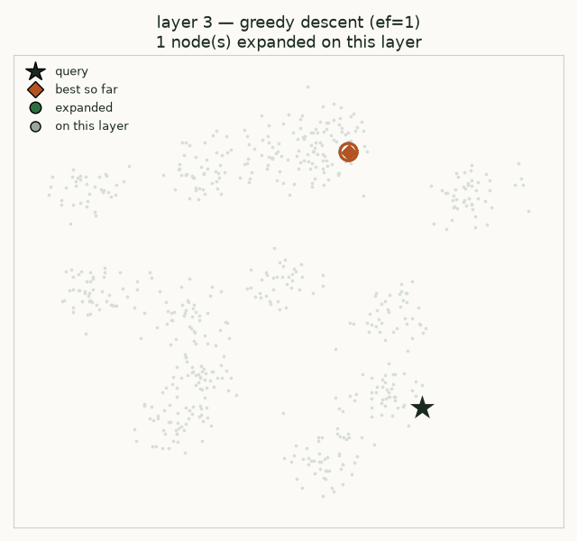

<em>One real query, replayed frame by frame from the index's own trace.<br/>
It sinks through the sparse upper layers with single greedy hops, then opens into a beam on layer 0.</em>

</div>

---

## What you are looking at

That animation is not a mock-up. It is a genuine `SearchTrace` from `HNSWIndex.search_traced`, replayed one expansion per frame by [`scripts/make_figures.py`](scripts/make_figures.py). Two dimensions and the L2 metric were chosen so the graph is drawable — everything else is the ordinary algorithm.

Read it as two distinct phases, because that is what HNSW is:

- **Upper layers (`ef = 1`).** Very few nodes live here, and their links are long. The search takes one greedy hop at a time, each layer handing its closest node down as the next starting point. This phase is almost free and covers almost all of the distance to the target.
- **Layer 0 (`ef = 24`).** Every vector lives here and the links are short. The search opens into a beam, expands a few dozen nodes, and most of that work goes into *confirming* the answer rather than finding it.

That asymmetry is the whole idea. The hierarchy gets you to the right neighborhood; the beam width decides how sure you are once you arrive.

---

## Table of Contents

- [Sixty-second tour](#sixty-second-tour)
- [Why Loam exists](#why-loam-exists)
- [What makes Loam different](#what-makes-loam-different)
- [How it works](#how-it-works)
- [Results](#results)
  - [The ef sweep](#the-ef-sweep)
  - [Read this table honestly](#read-this-table-honestly)
  - [Ablation 1: neighbor selection](#ablation-1-neighbor-selection)
  - [Ablation 2: is the H doing anything](#ablation-2-is-the-h-doing-anything)
  - [How the reported numbers were chosen](#how-the-reported-numbers-were-chosen)
- [Getting started](#getting-started)
- [Usage](#usage)
- [Architecture](#architecture)
- [Project structure](#project-structure)
- [Testing](#testing)
- [The one-day build plan](#the-one-day-build-plan)
- [Learning objectives](#learning-objectives)
- [Non-goals](#non-goals)
- [Roadmap](#roadmap)
- [Contributing](#contributing)
- [License](#license)
- [References](#references)

---

## Sixty-second tour

```bash
git clone https://github.com/VampiricCyborg/loam.git && cd loam
uv sync
uv run loam trace clustered --n 4000 --dim 16 --query-index 0 --ef 32
```

No dataset download, no configuration — `clustered` is generated on the fly. You get this:

<div align="center">
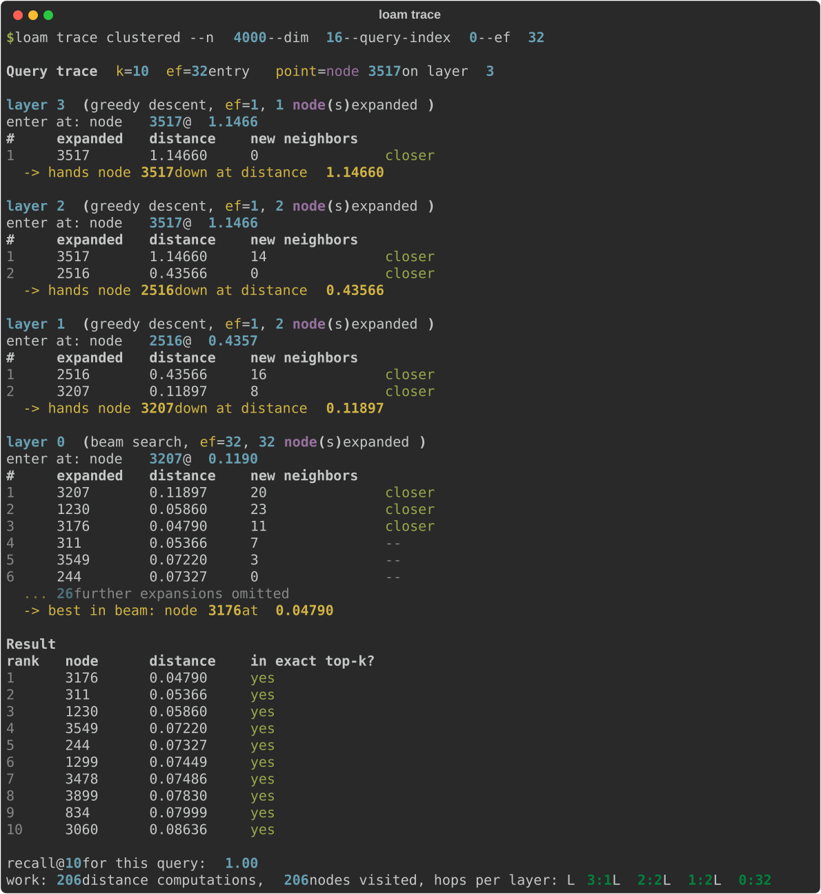
</div>

Every line of that is measured. The **`in exact top-k?`** column is checked against a brute-force `FlatIndex` running on the same vectors, so the trace tells you not only what the index returned but whether it was *right*.

The last line is the part production libraries never show you:

```text
work: 206 distance computations, 206 nodes visited, hops per layer: L3:1  L2:2  L1:2  L0:32
```

One or two hops on each upper layer. Thirty-two on layer 0. That is where your `ef` budget goes — and 206 distances is 5% of the 4,000 an exact scan would have cost.

---

## Why Loam exists

Every RAG pipeline ends in a call like `collection.query(embedding, k=10)`. Behind that call sits an ANN index making a trade you never see. It returns *approximately* the nearest neighbors, and how approximate depends on `M`, `ef_construction` and `ef` — parameters most users never touch.

This causes three practical problems:

| | Problem | Consequence |
|---|---|---|
| 1 | **Recall degrades silently** | A too-small `ef` returns plausible but wrong neighbors. Nothing errors. Retrieval quality just drops. |
| 2 | **The trade-off is invisible** | Libraries expose knobs but not the work each query did, so you cannot build intuition for why a setting helps. |
| 3 | **The algorithm is treated as magic** | HNSW is a graph built from a few hundred lines of logic. After building it once, tuning any vector database stops being guesswork. |

Loam makes that machinery visible: small enough to read in one sitting, measured precisely enough to trust.

> **The rule for this repo:** every number in this README is pasted from the stdout of a command in this repo, and the command sits next to it. Every image is generated by [`scripts/make_figures.py`](scripts/make_figures.py) from committed data. If a number has no command, it does not belong here.

---

## What makes Loam different

Loam is **not** faster than hnswlib or FAISS, and never will be. Those are optimized C++ with SIMD. Loam's value is in what it lets you *see and verify*:

| Capability | hnswlib / FAISS / pgvector | Loam |
|---|:---:|:---:|
| Production speed | ✅ | ❌ (pure Python + numpy) |
| Code maps 1:1 to the paper's Algorithms 1–5 | ❌ | ✅ |
| Per-query instrumentation (hops per layer, visited, distance computations) | ❌ | ✅ |
| Built-in exact oracle for recall@k on every benchmark | ❌ (external) | ✅ |
| Search-path trace through each layer | ❌ | ✅ `loam trace` |
| One-flag ablation: heuristic vs simple neighbor selection | ❌ | ✅ |
| One-flag ablation: hierarchy on vs off (flat NSW) | ❌ | ✅ |

And the two ablations reproduce **published claims** at laptop scale — results below, not assertions.

---

## How it works

### The layered graph

Each inserted element draws a random maximum layer `l = ⌊−ln(U(0,1)) · mL⌋`, with `mL = 1/ln(M)`. Few elements reach the high layers; every element exists on layer 0.

That is not just theory — it is measurable, and it lands almost exactly where the maths says it should:

<div align="center">
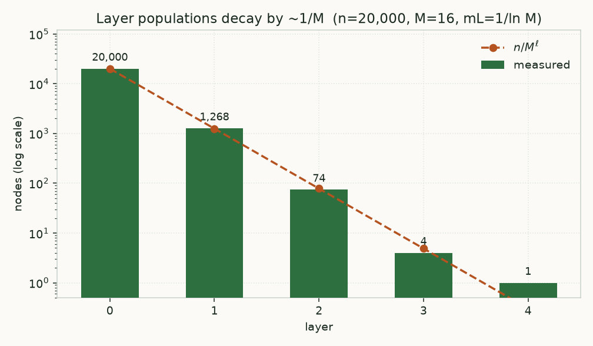
</div>

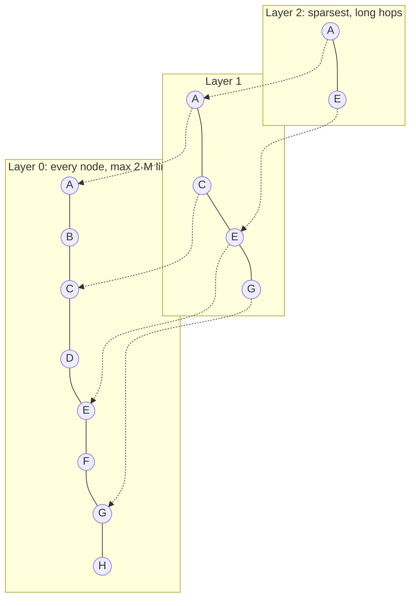

### Search: Algorithm 5 → Algorithm 2

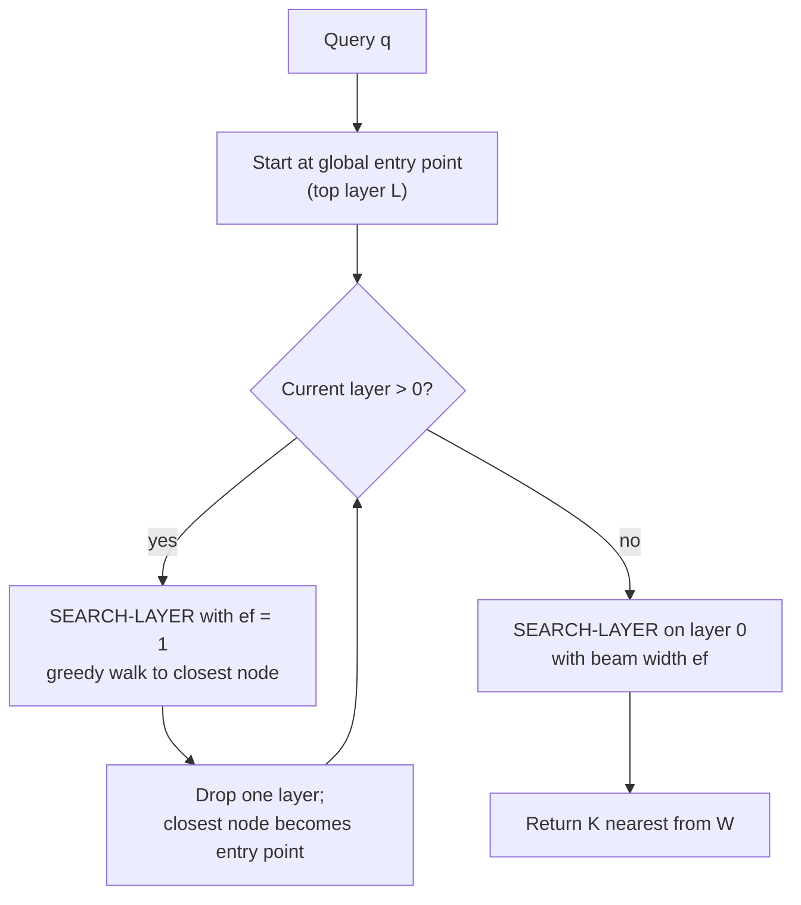

Inside **SEARCH-LAYER** (Algorithm 2):

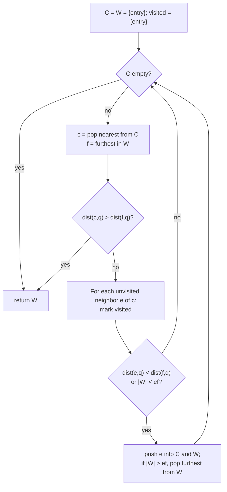

### Insert: Algorithm 1

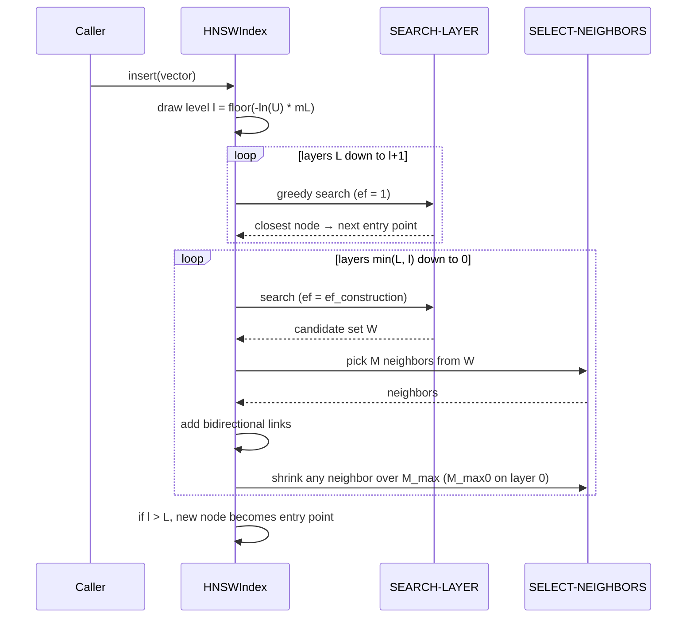

### Neighbor selection: simple vs heuristic

- **Simple (Algorithm 3)** keeps the `M` closest candidates.
- **Heuristic (Algorithm 4)** walks candidates nearest-first and keeps `e` only if `e` is closer to `q` than to every neighbor already kept. The result spreads across directions instead of bunching into one cluster, which is what keeps the graph navigable on clustered data.

The measured consequence of that one difference is [Ablation 1](#ablation-1-neighbor-selection).

### Where the code lives

Every method is named after the algorithm it implements:

| Paper | Loam |
|---|---|
| Algorithm 1 — INSERT | [`HNSWIndex.insert`](src/loam/hnsw.py) |
| Algorithm 2 — SEARCH-LAYER | [`HNSWIndex._search_layer`](src/loam/hnsw.py) |
| Algorithm 3 — SELECT-NEIGHBORS-SIMPLE | [`HNSWIndex._select_neighbors_simple`](src/loam/hnsw.py) |
| Algorithm 4 — SELECT-NEIGHBORS-HEURISTIC | [`HNSWIndex._select_neighbors_heuristic`](src/loam/hnsw.py) |
| Algorithm 5 — K-NN-SEARCH | [`HNSWIndex.knn_search`](src/loam/hnsw.py) |

---

## Results

**Machine for every table and chart below:** `Windows 11, Intel64 Family 6 Model 154 Stepping 3, GenuineIntel, Python 3.13.1` (numpy 2.5.3, single-threaded). That string is what `loam version` prints, and every command echoes it.

### The ef sweep

```bash
uv run loam bench glove-25-angular --n 10000 --queries 1000 --k 10 \
  -M 16 --ef-construction 200 --ef 16,32,64,128,256 \
  --out bench/results/glove25-ef-sweep.csv --plot
```

Build: **44.6 s** (4.46 ms/insert). Layer sizes `[10000, 571, 35, 5]`.

<div align="center">
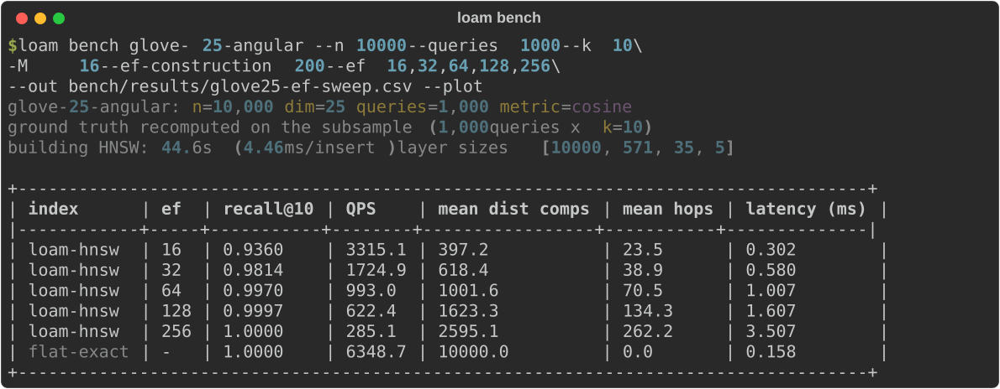
</div>

| ef | recall@10 | QPS (1 thread) | mean distance comps / query | mean hops | latency (ms) |
|---:|---:|---:|---:|---:|---:|
| 16 | 0.9360 | 3315.1 | 397.2 | 23.5 | 0.302 |
| 32 | 0.9814 | 1724.9 | 618.4 | 38.9 | 0.580 |
| 64 | 0.9970 | 993.0 | 1001.6 | 70.5 | 1.007 |
| 128 | 0.9997 | 622.4 | 1623.3 | 134.3 | 1.607 |
| 256 | 1.0000 | 285.1 | 2595.1 | 262.2 | 3.507 |
| **flat (exact)** | 1.0000 | 6348.7 | 10000.0 | — | 0.158 |

<table>
<tr>
<td width="50%"></td>
<td width="50%">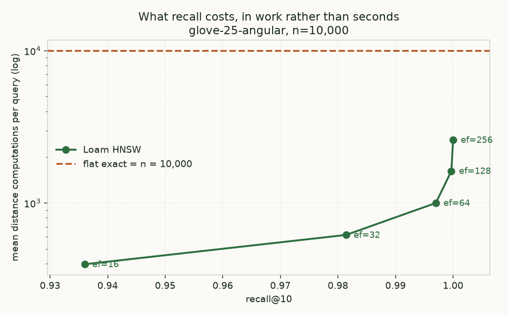</td>
</tr>
<tr>
<td align="center"><em>The conventional view. The y-axis is a property of this laptop.</em></td>
<td align="center"><em>The same trade-off in work. This one reproduces anywhere.</em></td>
</tr>
</table>

### Read this table honestly

**At n = 10,000 the exact index is the faster one.** That is not a bug, and it is the most useful thing in this repo.

The algorithmic win is real and large — at `ef=16`, HNSW answers with **397 distance computations instead of 10,000**, a 25× reduction, and still gets 93.6% of the true top-10. But Loam loses on wall clock anyway, because the two indexes pay very different prices per distance:

- `FlatIndex` computes all 10,000 distances in **one** numpy call: a single BLAS matmul over one contiguous `(10000, 25)` matrix. At 0.158 ms per query that is **~16 ns per distance**.
- `HNSWIndex` computes its 397 distances across **23.5 separate** gather-plus-matmul calls, one per expanded node, each carrying Python interpreter overhead that dwarfs its arithmetic. At 0.302 ms per query that is **~760 ns per distance**, roughly 48× more expensive each.

So the two effects nearly cancel: 25× fewer distances, each about 48× dearer, leaves HNSW **1.9× slower on the clock** while doing far less work.

The crossover needs either a much larger `n` (where the flat matmul stops being cheap) or an implementation where every distance costs the same — which is exactly what hnswlib's C++ buys, and exactly why Loam does not try to compete with it. **Loam's job is to show you the 397, and it does.**

### Ablation 1: neighbor selection

Algorithm 3 (nearest-M) versus Algorithm 4 (the diversity heuristic). Same data, same seed, same `M` and `ef_construction`; the only difference is which SELECT-NEIGHBORS runs.

```bash
uv run loam ablate selection --dataset clustered --clusters 100 --dim 10 \
  --n 20000 --queries 1000 --ef 16,32,64,128 \
  --out bench/results/ablate-selection.csv
```

<div align="center">
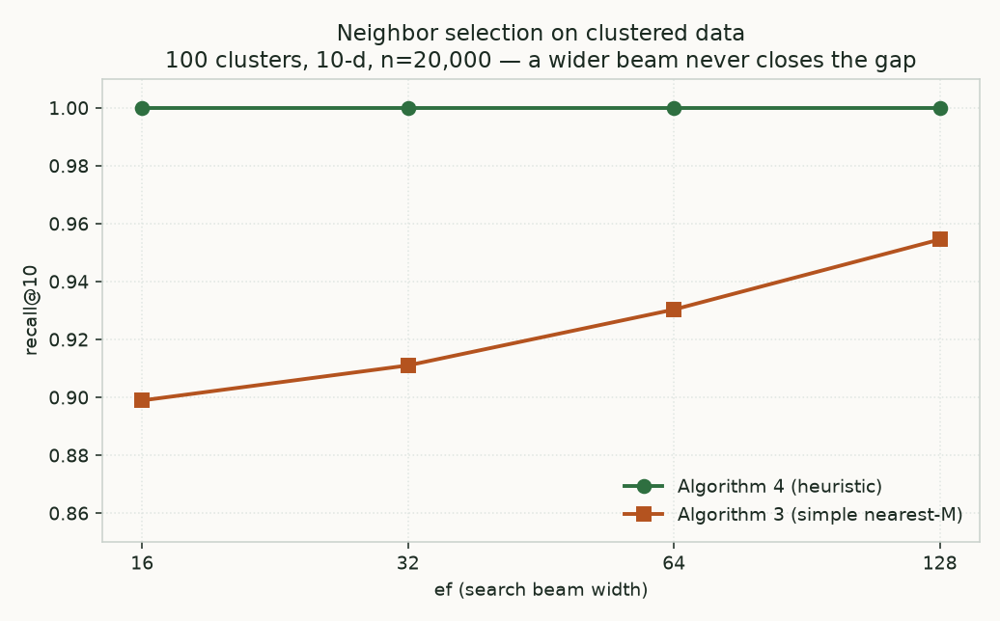
</div>

Build: simple **19.7 s**, heuristic **41.5 s**.

| ef | simple recall@10 | heuristic recall@10 | difference | simple QPS | heuristic QPS |
|---:|---:|---:|---:|---:|---:|
| 16 | 0.8989 | **1.0000** | +0.1011 | 4664.2 | 3735.4 |
| 32 | 0.9110 | **1.0000** | +0.0890 | 3334.5 | 2609.3 |
| 64 | 0.9303 | **1.0000** | +0.0697 | 2105.2 | 1642.6 |
| 128 | 0.9545 | **1.0000** | +0.0455 | 1544.3 | 1012.3 |

**The paper's Fig. 7 claim reproduces.** On 100 tight clusters in 10 dimensions, nearest-M selection tops out at 0.9545 even at `ef=128`, while the diversity heuristic is exact at every `ef` tested.

The *shape* matters as much as the gap: simple selection does not merely start lower, it converges slowly, because widening the beam cannot help a search that has no edge out of the cluster it landed in. Diverse links create those edges; extra beam width only searches harder within the same trap.

One detail worth pulling out of the CSV, because it rules out the obvious alternative explanation: **simple selection uses *fewer* distance computations at every `ef`** (196.6 vs 208.8 at `ef=16`; 294.3 vs 354.6 at `ef=128`) while scoring worse. It is not losing because it searches less hard. It is losing because its graph has nowhere good to go.

The cost is real and visible: the heuristic build takes 2.1× as long, and its graphs are slower to query because it fills the degree budget. On clustered data that is an obvious trade to make.

### Ablation 2: is the H doing anything

```bash
uv run loam ablate hierarchy --dataset glove-25-angular --n 10000 \
  --queries 1000 --ef 16,32,64,128,256 \
  --out bench/results/ablate-hierarchy.csv
```

<div align="center">
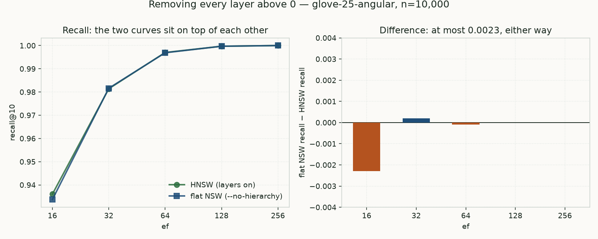
</div>

Build: HNSW **45.9 s**, flat NSW **23.4 s**.

| ef | HNSW recall@10 | flat NSW recall@10 | difference | HNSW QPS | flat NSW QPS |
|---:|---:|---:|---:|---:|---:|
| 16 | 0.9360 | 0.9337 | −0.0023 | 3242.7 | 3622.3 |
| 32 | 0.9814 | 0.9816 | +0.0002 | 2087.4 | 2226.8 |
| 64 | 0.9970 | 0.9969 | −0.0001 | 1202.6 | 1279.0 |
| 128 | 0.9997 | 0.9997 | +0.0000 | 649.1 | 676.8 |
| 256 | 1.0000 | 1.0000 | +0.0000 | 362.6 | 366.3 |

**[*Down with the Hierarchy*](https://arxiv.org/abs/2412.01940) reproduces here too.** Deleting every layer above 0 costs at most 0.0023 recall, and the flat graph is *slightly faster at every `ef`* while building in half the time. At this scale and dimension, the layers earn nothing.

Two honest caveats before anyone generalizes this:

1. **25 dimensions is not "high-dimensional"** by that paper's standard, and its argument is specifically about high-dimensional regimes. This result is consistent with the paper's claim but is not a test of its hardest case.
2. **n = 10,000 is small.** The hierarchy exists to shorten the greedy walk from a random entry point to the query's neighborhood, and that walk is short when the graph is small. The upper layers here hold 571, 35 and 5 nodes; there is not much routing for them to do.

The trace agrees: the descent through layers 3, 2 and 1 costs only a couple of hops each, so removing it saves little and costs little.

### How the reported numbers were chosen

**Each table is one run of the single command printed above it. Not a median, not a best-of-N, not an average.** Averaging would produce a table no command reproduces, which is the thing this repo's rule exists to prevent. Specifically, the `ef` sweep command was executed three times and the table reports **the third run** — the one whose `bench/results/glove25-ef-sweep.csv` and `.png` are the committed artifacts. You can diff the table against that CSV line by line.

That choice needs disclosing, because wall-clock on this machine is noisy. All three runs, same command, same seed:

| run | build (s) | flat-exact QPS | HNSW QPS @ ef=16 | recall@10 @ ef=16 | mean dist comps @ ef=16 |
|---|---:|---:|---:|---:|---:|
| 1 | 194.4 | 15519.3 | 3301.4 | 0.9360 | 397.2 |
| 2 | 31.5 | 13508.9 | 3417.9 | 0.9360 | 397.2 |
| 3 (**reported**) | 44.6 | 6348.7 | 3315.1 | 0.9360 | 397.2 |

Read that before trusting any timing on this page:

- **Build time spans 6.2×** (31.5 s to 194.4 s) and **flat-index throughput spans 2.4×** (6349 to 15519 QPS) on an identical workload. Run 1's build coincided with a freshly downloaded 127 MB dataset file still being touched by the OS; the cause is not proven, so it is reported rather than discarded.
- **HNSW query throughput was stable to within 4%** across all three runs (3301 / 3418 / 3315 QPS). Only the flat path swung. A plausible explanation is that one large BLAS call is sensitive to CPU boost and thermal state while an interpreter-bound loop is not — but that is a hypothesis, not something measured here.
- **Recall and mean distance computations were identical to every digit in all three runs**, because the build is deterministic given a seed. They are properties of the algorithm, not of the afternoon.

Note which way the reporting choice cuts. Run 3 has the *lowest* flat-index QPS of the three, so it is the run **least** favorable to the "the exact index is faster" conclusion: it shows flat winning by 1.9×, where runs 1 and 2 would have shown 4.7× and 4.0×. The headline finding is conservative, not cherry-picked.

**So: treat the recall and distance-computation columns as exact and reproducible. Treat the QPS, latency and build-time columns as order-of-magnitude only.** If you need trustworthy timings, run the command yourself on a quiet machine several times and compare distributions, not single values.

Other methodology notes:

- Recall is the mean of `|approx ∩ exact| / k` over all queries, against ground truth recomputed by `FlatIndex` on the same subsample.
- QPS is single-threaded wall-clock over all queries, after a warm-up pass. Loam does not batch queries, so QPS is the reciprocal of mean latency.
- Instrumentation is collected on the same pass that is timed; the counters are integer increments and are noise next to the numpy calls around them.

---

## Getting started

### Prerequisites

- Python **3.12 or newer** (numpy 2.x requires ≥ 3.12)
- [uv](https://docs.astral.sh/uv/) (recommended) or pip
- ~130 MB of free disk space for the default dataset (`glove-25-angular`)
- *Optional:* a C++ compiler, needed only for the hnswlib reference comparison

### Installation

```bash
git clone https://github.com/VampiricCyborg/loam.git
cd loam
uv sync
```

With pip:

```bash
python -m venv .venv
source .venv/bin/activate        # Windows: .venv\Scripts\activate
pip install -e ".[dev]"
```

Optional hnswlib reference comparison:

```bash
uv sync --extra reference
```

> `hnswlib` 0.8.0 is published on PyPI as a source distribution only, so installing it requires a C++ compiler. It is an optional extra and nothing in Loam's core depends on it. Without it, `--reference hnswlib` prints a clear skip message and the rest of the benchmark runs normally.

Verify:

```bash
uv run pytest -q
uv run loam --help
```

### Fetch a dataset

```bash
uv run loam fetch glove-25-angular      # 127 MB HDF5
```

The HDF5 file contains `train`, `test`, `neighbors` and `distances`. Because Loam benchmarks on a **subsample** of `train`, the shipped `neighbors` are not valid for it — they name IDs that are no longer in the index. Loam always recomputes ground truth with `FlatIndex` after subsampling. Using the shipped array on a subsample would silently deflate every recall number in this repo, which is exactly the class of quiet wrongness the project exists to avoid.

---

## Usage

### Python API

```python
import numpy as np
from loam import FlatIndex, HNSWIndex

rng = np.random.default_rng(0)
data = rng.standard_normal((10_000, 64), dtype=np.float32)
queries = rng.standard_normal((100, 64), dtype=np.float32)

index = HNSWIndex(dim=64, metric="cosine", M=16, ef_construction=200, seed=42)
index.add(data)                                   # ids are row positions 0..n-1

ids, dists, stats = index.search(queries[0], k=10, ef=64, return_stats=True)
print(ids)
print(stats.distance_computations, stats.visited, stats.hops_per_layer)

# Check against the exact oracle
oracle = FlatIndex(dim=64, metric="cosine")
oracle.add(data)
exact_ids, _ = oracle.search(queries[0], k=10)
recall = len(set(ids) & set(exact_ids)) / 10
print(f"recall@10 = {recall:.2f}")
```

Running that prints, for example:

```text
[1801 9893 9585 4944  417 5348 2755 1649   87 7030]
1408 1408 [(3, 2), (2, 2), (1, 1), (0, 64)]
recall@10 = 0.90
```

### CLI

| Command | What it does |
|---|---|
| `loam fetch <dataset>` | Download an ANN-Benchmarks HDF5 file |
| `loam bench <dataset>` | Sweep `ef`, score against the oracle, write CSV + plot |
| `loam ablate selection` | Algorithm 3 vs Algorithm 4 |
| `loam ablate hierarchy` | HNSW vs flat NSW (`--no-hierarchy`) |
| `loam trace <dataset>` | Print one query's path through every layer |
| `loam version` | Version and machine description |

```bash
# ef sweep with a plot
uv run loam bench glove-25-angular --n 10000 --queries 1000 --k 10 \
  -M 16 --ef-construction 200 --ef 16,32,64,128,256 \
  --out bench/results/glove25-ef-sweep.csv --plot

# ablations
uv run loam ablate selection --dataset clustered --clusters 100 --dim 10 --n 20000
uv run loam ablate hierarchy --dataset glove-25-angular --n 10000

# trace one query
uv run loam trace glove-25-angular --n 5000 --query-index 0 --ef 32

# optional: same data and parameters through hnswlib
uv run loam bench glove-25-angular --n 10000 --ef 16,32,64,128 --reference hnswlib
```

`clustered` and `random` are generated on the fly at any size, so every command above works with no download.

### Regenerating the figures

```bash
uv run python scripts/make_figures.py
```

Charts are replotted from the committed CSVs, the terminal captures are re-recorded from real `rich` output, and the animation is replayed from a fresh seeded trace.

---

## Architecture

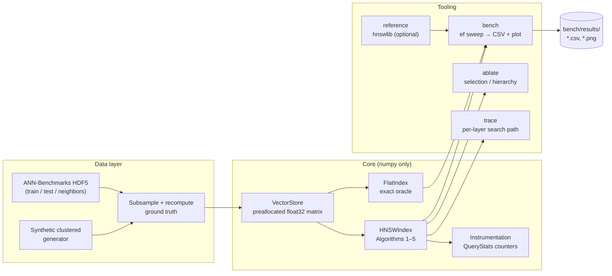

**Design decisions**

- **Vectors live in one preallocated `float32` matrix.** Node IDs are row indices. Distances from a query to a whole neighbor list are one numpy operation (`matrix[neighbor_ids] @ q`) instead of a Python loop. This is the single most important performance decision in a pure-Python HNSW — and, as the [ef sweep](#read-this-table-honestly) shows, still not enough to beat one big matmul at this scale.
- **Adjacency is `layers[level][node_id] -> list[int]`**, plain Python lists. Readable, easy to inspect, easy to assert invariants on.
- **Candidate set `C` is a min-heap; result set `W` is a max-heap** (distances negated), exactly as Algorithm 2 describes.
- **Cosine is implemented by normalizing at insert time**, so the hot path is a dot product.
- **The oracle is non-negotiable.** No recall number is reported without an exact k-NN computed by `FlatIndex` on the same data.
- **Measure before optimizing.** Two "obvious" vectorizations were tried and reverted after measurement: at 32-element adjacency lists, a numpy call costs more than the Python loop it replaces. The code carries comments where that happened.

---

## Project structure

```text
Loam/
├── src/loam/
│   ├── __init__.py          # exports FlatIndex, HNSWIndex, QueryStats
│   ├── distance.py          # cosine (pre-normalized) and squared-L2, batched
│   ├── store.py             # VectorStore: growable float32 matrix
│   ├── flat.py              # FlatIndex: exact brute-force oracle
│   ├── hnsw.py              # HNSWIndex: Algorithms 1–5, named after the paper
│   ├── stats.py             # QueryStats + SearchTrace
│   ├── datasets.py          # HDF5 loader, subsample + ground truth, generators
│   ├── bench.py             # ef sweep, recall/QPS measurement, CSV + plot
│   ├── trace.py             # per-layer search path printer
│   └── cli.py               # `loam` entrypoint: fetch, bench, ablate, trace
├── tests/
│   ├── test_flat.py         # oracle vs an independently written distance
│   ├── test_invariants.py   # hypothesis: degree bounds, layer nesting, no self-loops
│   ├── test_recall.py       # calibrated recall floors
│   └── test_determinism.py  # same seed → identical graph
├── scripts/make_figures.py  # regenerates every image in docs/assets/
├── bench/results/           # generated CSVs and plots (committed for the README)
├── docs/assets/             # generated figures, terminal captures, animation
├── .github/workflows/ci.yml
├── pyproject.toml
├── CONTRIBUTING.md
├── LICENSE
└── README.md
```

---

## Testing

```bash
uv run pytest -q                        # 35 tests
uv run pytest tests/test_invariants.py -q
```

**What the suite guarantees**

- **Oracle correctness.** `FlatIndex` is checked against a distance function written out by hand in the test file, not against `loam.distance`, so a sign error cannot agree with itself.
- **Graph invariants** (property-based, via hypothesis), after every build:
  - no node exceeds `M_max` links on layers ≥ 1, or `M_max0` on layer 0;
  - a node on layer `l` is present on every layer below it;
  - no self-loops, no duplicate links, every neighbor ID names a real node;
  - the entry point sits on the top populated layer.
- **Recall floors.** Measured first, then locked in. Each threshold was produced by running the configuration across five seeds, taking the *worst* recall observed, and rounding down with headroom — so the test fails on a real regression, not an unlucky draw. The floors and their measured values are recorded in comments next to each one.
- **Determinism.** Same data and seed produce an identical adjacency structure, identical answers, and identical instrumentation counters.
- **Ablation flags actually do something.** Each flag must change the graph, or the ablations would be comparing a variant against itself.

CI runs the suite on **Ubuntu and Windows × Python 3.12 and 3.13**, then smoke-tests the CLI end to end on generated data — no network, no HDF5 download.

---

## The one-day build plan

Each milestone is done only when its acceptance check passes. Every check below is now a test or a command in this repo, and the floors are the calibrated ones rather than the guesses the plan started with.

| # | Block | Deliverable | Acceptance check |
|---|---|---|---|
| 1 | Hour 0–1 | Scaffold, `distance.py`, `store.py`, `FlatIndex` | `test_flat.py` passes for cosine and L2 |
| 2 | Hour 1–4 | `HNSWIndex`: level draw, Algorithms 1, 2, 3, 5 | recall@10 ≥ 0.99 at ef=64 on 1,200 uniform 16-d vectors — `test_recall.py::test_recall_floor_on_uniform_data` |
| 3 | Hour 4–5 | Algorithm 4 heuristic + neighbor-list shrinking | `test_invariants.py` passes under hypothesis |
| 4 | Hour 5–7 | `datasets.py`, `bench.py`, CLI | `loam bench` writes CSV and plot for glove-25 |
| 5 | Hour 7–8 | `QueryStats` instrumentation + `loam ablate` | Both ablations produce a table |
| 6 | Hour 8–9 | `loam trace` | Readable per-layer path for one query |
| 7 | Hour 9–10 | README numbers, figures, CI, LICENSE, CONTRIBUTING | CI green; every README number has its command |

**Scope cut order if behind schedule:** hnswlib reference → `trace` → hierarchy ablation. Never cut: the oracle, the invariant tests, or the honest benchmark table.

---

## Learning objectives

After building Loam you should be able to explain:

- why exact k-NN is `O(n·d)` per query, and why that cost becomes infeasible at scale;
- how skip lists inspired HNSW's layer hierarchy, and why the level distribution is exponential;
- what `M`, `M_max0`, `ef_construction` and `ef` each control, and what each costs;
- why greedy graph search gets stuck in local minima, and how beam width and diverse neighbor selection avoid it;
- how to measure an approximate algorithm honestly, using an oracle, recall@k and a trade-off curve instead of a single number;
- why a 25× reduction in distance computations can still lose on wall clock, and what that says about where optimization effort belongs;
- what the "Hub Highway Hypothesis" claims and how to test it.

---

## Non-goals

- Deletion or updates (the paper supports them; Loam skips them for scope)
- Concurrency or multi-threaded build and search
- SIMD, Cython, Numba or any compiled speedups
- Quantization (PQ, SQ) or disk-resident indexes (DiskANN-style)
- Being a production vector database

---

## Roadmap

- [ ] Persistence: save/load the index to `.npz`
- [ ] Deletion via tombstones
- [ ] Hub analysis: in-degree distribution and hub traversal frequency, flat vs hierarchical
- [ ] Re-run the hierarchy ablation at higher dimension and larger `n`, where the paper's claim is actually contested
- [ ] Rust port of the hot path, benchmarked against the Python original

---

## Contributing

Contributions are welcome, especially bug reports where Loam's behavior diverges from the paper. See [CONTRIBUTING.md](CONTRIBUTING.md) for the full guide.

The short version: keep the core dependency-free, add tests for behavior changes, and **benchmark claims need commands** — if a PR changes performance, include the exact `loam bench` invocation and its before/after output.

---

## License

MIT. See [`LICENSE`](LICENSE).

---

## References

1. Yu. A. Malkov and D. A. Yashunin. *Efficient and Robust Approximate Nearest Neighbor Search Using Hierarchical Navigable Small World Graphs.* IEEE TPAMI 42(4), 824–836, 2020. [arXiv:1603.09320](https://arxiv.org/abs/1603.09320) · doi:10.1109/TPAMI.2018.2889473
2. Yu. A. Malkov, A. Ponomarenko, A. Logvinov and V. Krylov. *Approximate nearest neighbor algorithm based on navigable small world graphs.* Information Systems 45, 61–68, 2014.
3. B. Munyampirwa, V. Lakshman and B. Coleman. *Down with the Hierarchy: The 'H' in HNSW Stands for "Hubs".* [arXiv:2412.01940](https://arxiv.org/abs/2412.01940)
4. W. Pugh. *Skip Lists: A Probabilistic Alternative to Balanced Trees.* Communications of the ACM 33(6), 668–676, 1990.
5. M. Aumüller, E. Bernhardsson and A. Faithfull. *ANN-Benchmarks: A Benchmarking Tool for Approximate Nearest Neighbor Algorithms.* [github.com/erikbern/ann-benchmarks](https://github.com/erikbern/ann-benchmarks)
6. hnswlib: [github.com/nmslib/hnswlib](https://github.com/nmslib/hnswlib)
